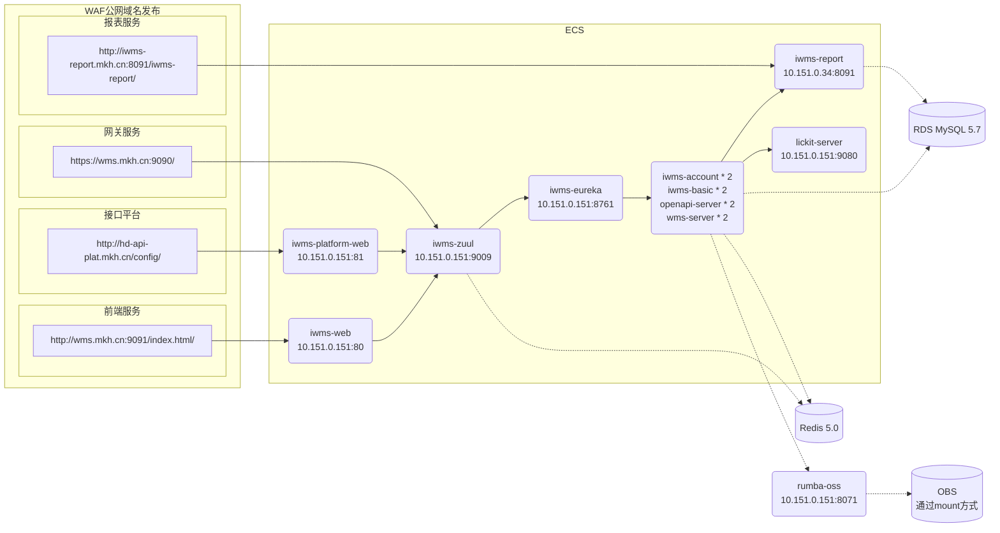

<font color="grey" size=3>资源信息说明，不适用部分可填「无」</font>

```
云厂商和区域：华为云-华北3(张家口) ？
是否托管： 否
资源组：「无」
iwms应用服务网关入口地址： https://wms.mkh.cn:9090/

域名列表：
- 前端登录：http://wms.mkh.cn:9091/
- 接口平台：iwms-apidocs.bailebaihuo.com
- 报表平台：iwms-report.bailebaihuo.com
- 网关地址：iwms-gw.bailebaihuo.com 

均由 明康汇 客户信息部通过waf发布至外网。
```

### iwms调用链路 

仅部署了iWMS组件   



需注意：通过上述接口图可看出，iWMS业务组件本身不支持华为云obs对象存储，通过mount方式将obs挂载至 `10.151.0.151` 并自建 `rumba-oss` 数据目录指向obs的挂载目录，完成对象存储数据存储。


### 机器及应用节点情况

<table>
    <tr>
        <td>ECS</td>
        <td>应用</td>
        <td>节点数</td>
    </tr>
    <tr>
        <td rowspan="5">10.151.0.151<br>4核16G</td>
        <td>lickit-server</td>
        <td>1</td>
    </tr>
    <tr>
        <td>iwms-eureka</td>
        <td>1</td>
    </tr>
    <tr>
        <td>iwms-zuul</td>
        <td>1</td>
    </tr>
    <tr>
        <td>iwms-web</td>
        <td>1</td>
    </tr>
    <tr>
        <td>iwms-platform-web</td>
        <td>1</td>
    </tr>
    <tr>
        <td rowspan="7">10.151.0.228<br>8核32G</td>
        <td>iwms-account</td>
        <td>1</td>
    </tr>
    <tr>
        <td>iwms-basic</td>
        <td>1</td>
    </tr>
    <tr>
        <td>openapi-server</td>
        <td>1</td>
    </tr>
    <tr>
        <td>wms-server</td>
        <td>1</td>
    </tr>
    <tr>
        <td rowspan="6">172.26.217.22<br>4核16G</td>
        <td>iwms-account</td>
        <td>1</td>
    </tr>
    <tr>
        <td>iwms-basic</td>
        <td>1</td>
    </tr>
    <tr>
        <td>openapi-server</td>
        <td>1</td>
    </tr>
    <tr>
        <td>wms-server</td>
        <td>1</td>
    </tr>
    <tr>
        <td>ips-archive</td>
        <td>1</td>
    </tr>
    <tr>
        <td>ips-bill</td>
        <td>1</td>
    </tr>
    <tr>
        <td rowspan="1">172.26.217.20<br>4核32G</td>
        <td>iwms-report</td>
        <td>1</td>
    </tr>
</table>
